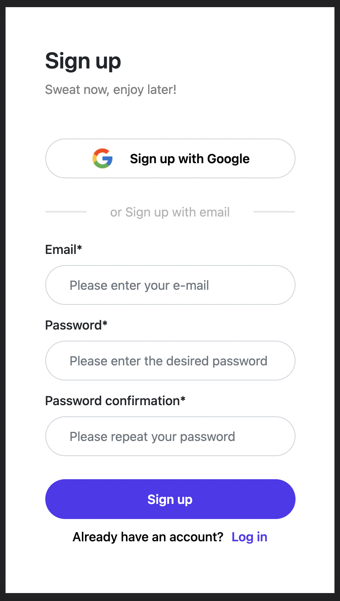

# Gymeasure app(with firebase/firestore) - track your gym progress 

## Application URL

[App-Url](https://gymeasure-production-6dcb6.web.app/) 

## Screenshots

### Current functionalities

-   Login with email/pw (firebase)
-   Signup with email/pw (firebase)
-   Logout (firebase)
-   Forgot password module with rest link via email (firebase)
-   Verification link sent to email after sign up (firebase)
-   Login validation : no login until account verified
-   Realtime UI data display / update
-   Add / Edit personal data (firestore)
-   Add personal info input validation
-   Server-side CRUD on measurements (firestore)
-   Add measurements input validation
-   Live search bar (UI updating on every keystroke)
-   CI / CD with Github actions and Firebase

### Tech tree

-   
-   
-   
-   
-   
-   
-   

### To do list

-   Posibility to add photos / each measurements "session" to keep track of visual progress
-   UI/UX improvement
-   Code review (50% done)
